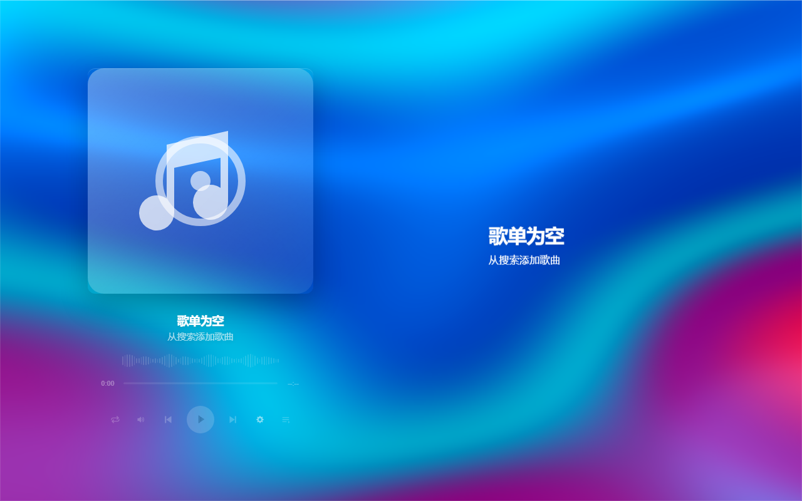
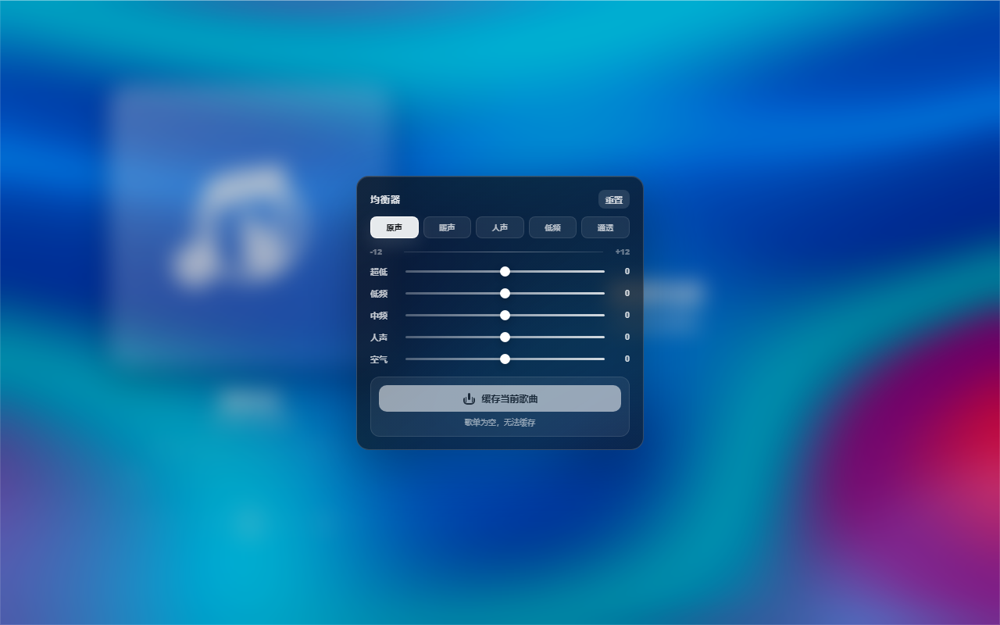

# Immersive Lyrics

一款为桌面听歌体验设计的沉浸式歌词播放器。它把封面取色、动态背景、逐字/逐句歌词、平台搜索、B 站导入和离线缓存放在同一个安静漂亮的界面里。

> 本项目与 Apple Inc. 或 Apple Music 没有任何关联。公开版本不内置任何音乐、封面或歌词样例资源。



## 截图

| 搜索与登录 | 均衡器与离线缓存 |
| --- | --- |
|  |  |

## 功能

- 沉浸式歌词界面：支持逐字歌词、逐句歌词、翻译小字和顺滑滚动。
- 动态背景：根据封面取色生成柔和的丝绸感背景。
- 多平台接入：支持网易云音乐、QQ 音乐搜索，以及通过 BV 号/链接导入 B 站视频音频。
- 本地离线缓存：可缓存当前歌曲的音频、歌词和封面，后续离线播放。
- B 站本地导入：音频、字幕、封面和可选视频背景落盘保存。
- 5 段均衡器：提供原声、暖声、人声、低频、通透等预设。
- Windows 桌面体验：自定义玻璃质感标题栏，支持 NSIS 安装包。

## 下载

前往 [Releases](https://github.com/doiiaioiiiailphin-cmyk/immersive-lyrics/releases) 下载 Windows 安装包。

当前公开构建不包含任何内置音乐。首次打开时歌单为空，需要通过搜索、导入或本地缓存添加歌曲。

## 本地开发

环境要求：

- Windows
- Python 3.11+
- Node.js 22+
- PyInstaller

安装依赖：

```powershell
npm install
```

运行语法检查：

```powershell
npm run check
npm run check:python
```

启动网页后端：

```powershell
python serve.py 8765
```

打包 Windows 安装包：

```powershell
npm run pack:win
```

## 隐私与数据

- 公开源码和安装包不包含音乐文件、封面样例、歌词样例、用户缓存或登录数据。
- 用户歌单、播放进度和个性化设置保存在本机。
- 平台登录 Cookie 只用于本机请求对应音乐服务。
- 离线缓存保存到本机应用数据目录，删除歌曲时会同步删除对应缓存包。

## 第三方说明

接口兼容和实现参考见 [THIRD_PARTY_NOTICES.md](THIRD_PARTY_NOTICES.md)。
